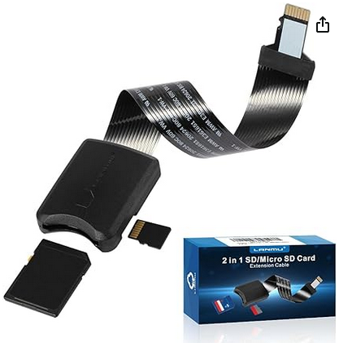

# Quad Cortex Guitar Amp Modeler : Install Helper Tool to configure and activate SSH Login

To use this tool you need a Linux system and you need to insert the SD card to a card reader.
You need to know the device name for partition 1 and 2 of the Quad Cortex OS Image !

You need to prepare a tar archive with an authorized_keys file and name it exactly 'qc_ssh_root.tgz':

```
$ tar tzvf qc_ssh_root.tgz 
drwx------ root/root         0 2024-06-19 13:15 .ssh/
-rw-rw-r-- root/root       687 2024-06-19 13:16 .ssh/authorized_keys
```

Usage Example:

```
$ ./qc_ssh_install.sh /dev/sde1
$ ./qc_ssh_install.sh /dev/sde2
```

You need always to run this on both partitions !

I can highly recommend to use such a SD card expansion for an easy access to the QC System Image:



Buyer beware ;) Use all the code on your own risk !

---

06/20/2024/ml

